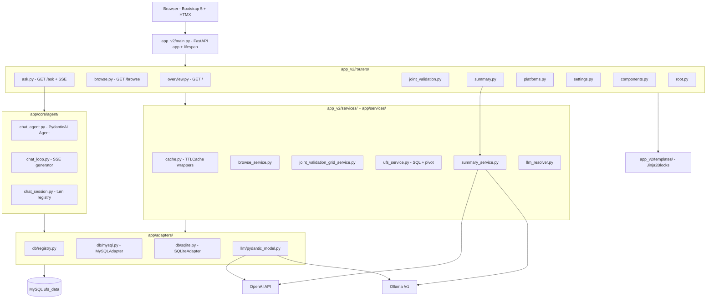

<!-- generated-by: gsd-doc-writer -->
# Architecture

## System overview

PBM2 (Platform Dashboard V1) is a synchronous FastAPI web application that gives non-SQL users a wide-form view over a long-form (EAV) MySQL parameter database (`ufs_data`). The system has three architectural concerns: (1) a layered HTTP/UI tier built on FastAPI + Bootstrap 5 + HTMX + Jinja2 (with `jinja2-fragments` for HTMX out-of-band swaps); (2) a read-only data tier that issues parameterized SQL through a thin DB-adapter abstraction over SQLAlchemy 2.x + pymysql, with pandas pivoting long-form rows into wide-form grids; and (3) a dual-backend LLM tier (OpenAI cloud + Ollama local, runtime-switchable via cookie) consumed by a PydanticAI agent for the natural-language Ask tab and the AI Summary feature. The architectural style is layered (routers → services → adapters) with a single composition root in `app_v2/main.py`.

## Component diagram



The layering rule is one-way: routers import from services and adapters; services import from adapters; adapters know nothing about FastAPI. `app_v2/services/browse_service.py` makes this explicit — it is pure Python with no FastAPI/Starlette imports — and `app/services/ufs_service.py` is similarly framework-agnostic so it can be reused by both v2 routes and the PydanticAI agent's `run_sql` tool.

## Data flow

The two characteristic flows are the **Browse pivot pipeline** (the canonical EAV → wide-form pipeline) and the **Ask agentic chat pipeline**.

### Browse pivot pipeline (EAV → wide-form)

1. The user opens `/browse?platforms=A&platforms=B&params=cat%20%C2%B7%20item` (or POSTs the same as form fields to `/browse/grid` via HTMX). Route handler is `app_v2/routers/browse.py::browse_page` / `browse_grid`.
2. The handler resolves the shared `DBAdapter` from `request.app.state.db` (set during lifespan startup in `app_v2/main.py`) via the `get_db` dependency, then calls `app_v2/services/browse_service.py::build_view_model`.
3. `build_view_model` pulls the platform/parameter catalogs through TTLCache wrappers in `app_v2/services/cache.py` (`list_platforms`, `list_parameters_for_platforms`, `fetch_cells`). The cache is keyed by `db_name` (not the unhashable adapter object) and protected by per-cache `threading.Lock` instances; TTLs are 300 s for catalog data and 60 s for cell data.
4. Cell fetching delegates to `app/services/ufs_service.py::fetch_cells`, which executes a parameterized `SELECT PLATFORM_ID, InfoCategory, Item, Result FROM <table> WHERE PLATFORM_ID IN :platforms AND Item IN :items LIMIT :cap` using `sa.bindparam(..., expanding=True)`. The table name is validated against `settings.app.agent.allowed_tables` by `_safe_table` before being interpolated into `sa.text()`. A `SET SESSION TRANSACTION READ ONLY` statement is attempted on every connection.
5. Results are normalized through `app/services/result_normalizer.py::normalize` and pivoted to wide form by `pivot_to_wide` (pandas `pivot_table` with `aggfunc='first'`). The default orientation is `PLATFORM_ID` as index and `Item` as columns; `swap_axes=True` inverts that. A 30-column cap (`COL_CAP`) and 200-row cap (`ROW_CAP`) are enforced server-side.
6. The handler renders `app_v2/templates/browse/index.html` through the `Jinja2Blocks` instance from `app_v2/templates/__init__.py`. For HTMX POSTs, only the named blocks `grid`, `count_oob`, `warnings_oob`, `picker_badges_oob`, and conditionally `params_picker_oob` are emitted as the response body. The `HX-Push-Url` response header rewrites the address bar to the canonical GET URL so the page is reload-safe.

### Ask agentic chat pipeline

1. POST `/ask/chat` (handled in `app_v2/routers/ask.py`) creates a turn via `app/core/agent/chat_session.py::new_turn`, persists the question, and returns an HTML fragment containing a user-message bubble plus an SSE consumer (`<div hx-ext="sse" sse-connect="/ask/stream/{turn_id}">`).
2. GET `/ask/stream/{turn_id}` (one of two `async def` routes in the file — required for streaming) validates the `pbm2_session` cookie against `chat_session.get_session_id_for_turn`, returns `403` on mismatch (turn IDs are 128-bit `uuid4().hex`), then opens an `EventSourceResponse`.
3. The route resolves the active LLM via `app_v2/services/llm_resolver.py::resolve_active_llm`, which honors the `pbm2_llm` cookie (validated against configured names) before falling back to `settings.app.default_llm`. It instantiates a PydanticAI model through `app/adapters/llm/pydantic_model.py::build_pydantic_model` (returns `OpenAIChatModel` or `OllamaModel` with the appropriate provider).
4. `app/core/agent/chat_agent.py::build_chat_agent` builds a PydanticAI `Agent` with `ToolOutput(PresentResult)` as the structured terminal output and tools `inspect_schema`, `get_distinct_values`, `count_rows`, `sample_rows`, `run_sql`, and `present_result`. `run_sql` runs every candidate query through `app/services/sql_validator.py::validate_sql` (single-statement SELECT, no UNION/INTERSECT/EXCEPT, no comments, no CTE, allowlisted tables) and `app/services/sql_limiter.py::inject_limit` before executing.
5. `app/core/agent/chat_loop.py::stream_chat_turn` drives `agent.run_stream_events`, yielding event dicts that the route wraps as `ServerSentEvent` frames. Cancellation is checked between tool-result events via an `asyncio.Event` stored in the turn registry; the budget is bounded by `settings.app.agent.chat_max_steps` (default 12) via `pydantic_ai.usage.UsageLimits`.
6. On `PresentResult`, the router re-runs `present_result.sql` against the DB, builds the Plotly chart server-side from the typed `ChartSpec`, and emits a final SSE frame whose `_final_card.html` fragment is swapped into the chat surface.

## Key abstractions

| Abstraction | Type | Location | Purpose |
| --- | --- | --- | --- |
| `DBAdapter` | abstract base class | `app/adapters/db/base.py` | Uniform `test_connection`, `list_tables`, `get_schema`, `run_query`, `dispose` over MySQL/SQLite. |
| `MySQLAdapter` / `SQLiteAdapter` | concrete adapters | `app/adapters/db/mysql.py`, `app/adapters/db/sqlite.py` | SQLAlchemy `Engine` lifecycle (`pool_pre_ping=True`, `pool_recycle=3600`); read-only session enforcement. |
| `Settings` / `DatabaseConfig` / `LLMConfig` / `AppConfig` / `AgentConfig` | Pydantic v2 models | `app/core/config.py`, `app/core/agent/config.py` | Typed YAML settings loaded from `config/settings.yaml` (or `$SETTINGS_PATH`). |
| `BrowseViewModel` | dataclass | `app_v2/services/browse_service.py` | Single render contract for `/browse` GET and POST; rows, columns, caps, swap-axes, highlight, minority-cell set. |
| `JointValidationGridViewModel` | Pydantic BaseModel | `app_v2/services/joint_validation_grid_service.py` | Listing model for the auto-discovered Joint Validation rows shown on `/`. |
| `ChatAgentDeps` / `PresentResult` / `ChartSpec` | Pydantic models | `app/core/agent/chat_agent.py` | RunContext deps and structured terminal output for the chat agent. |
| `Jinja2Blocks` templates singleton | module-level object | `app_v2/templates/__init__.py` | Single `templates` import used by every router; backed by `jinja2_fragments.fastapi.Jinja2Blocks` so routes can render named template blocks for HTMX OOB swaps. |
| TTLCache wrappers | module-level caches + locks | `app_v2/services/cache.py` | Thread-safe `cachetools.TTLCache` wrappers around `ufs_service.list_platforms`, `list_parameters`, `list_parameters_for_platforms`, `fetch_cells`; partitioned by `db_name`. |
| `resolve_active_llm` / `resolve_active_backend_name` | functions | `app_v2/services/llm_resolver.py` | Single source of truth for "which LLM is active right now"; honors the `pbm2_llm` cookie. |
| `build_pydantic_model` | factory function | `app/adapters/llm/pydantic_model.py` | Returns `OpenAIChatModel` or `OllamaModel` from an `LLMConfig`; the only place that knows how to point the OpenAI SDK at Ollama's `/v1`. |
| `validate_sql` / `inject_limit` | pure functions | `app/services/sql_validator.py`, `app/services/sql_limiter.py` | Static SQL guards used by both the legacy NL agent and the new chat agent's `run_sql` tool. |

## Directory structure rationale

```
app_v2/                      Canonical FastAPI shell (v2.0+, supersedes legacy app/main.py)
  main.py                    App entry: lifespan, exception handlers, router registration order
  routers/                   One router per feature area (overview, browse, ask, summary, joint_validation,
                             platforms, settings, components, root); registration order in main.py matters
  services/                  Per-feature orchestration; pure Python, no FastAPI imports
  templates/                 Jinja2 templates organized by feature; _components/ for shared macros
  static/                    css/ (tokens.css + app.css), js/ (htmx-error-handler, popover-search, chip-toggle),
                             vendor/ (Bootstrap 5.3.8, HTMX 2.0.10, Bootstrap Icons 1.13.1, Plotly)
  data/                      Pure parsers and prompt builders (platform_parser, summary_prompt, atomic_write)

app/                         Cross-cutting library code shared by app_v2 (and legacy v1 leftovers)
  adapters/                  Hex-arch adapters: db/ (DBAdapter + MySQL/SQLite implementations + registry)
                             and llm/ (PydanticAI model factory)
  core/                      Domain core: config.py (Settings) + agent/ (chat_agent, chat_loop, chat_session,
                             nl_agent, nl_service — multi-step + legacy single-shot)
  services/                  Domain services: ufs_service (the EAV pipeline), sql_validator, sql_limiter,
                             path_scrubber, result_normalizer, ollama_fallback

config/                      YAML files: settings.yaml (active), *.example.yaml (templates), browse_presets,
                             starter_prompts
content/                     Filesystem content: platforms/ (markdown CRUD), joint_validation/<numeric_id>/
                             (drop-folder workflow — index.html files auto-discovered by overview tab)
data/                        demo_ufs.db SQLite fixture used by scripts/seed_demo_db.py and tests
tests/                       pytest suite; tests/v2/ holds 568+ test functions covering every router, service,
                             and the chat agent invariants
scripts/                     One-off CLI utilities (seed_demo_db.py)
```

The split between `app_v2/` and `app/` is historical: `app/` predates the v2.0 stack switch and now hosts cross-cutting code (DB adapters, LLM adapter, SQL safety, the agent) that is not specific to the FastAPI shell. `app_v2/` is the canonical FastAPI app and the only entry point — start it with `uvicorn app_v2.main:app`. New code that is HTTP-aware belongs under `app_v2/`; new code that is framework-agnostic and could plausibly be reused by a non-FastAPI surface belongs under `app/`.

Within `app_v2/routers/`, **registration order in `main.py` is load-bearing**: `overview` registers `GET /`, then `platforms` and `summary` (both prefixed `/platforms`), then `joint_validation`, `browse`, `ask`, `settings`, `components`, and finally `root` last. This ordering is documented in the `main.py` docstring and prevents an empty stub in `root.py` from shadowing a real route in another router. The HTMX OOB pattern relies on `Jinja2Blocks.TemplateResponse(..., block_names=[...])` — every HTMX-driven endpoint emits a small set of named blocks (`grid`, `count_oob`, `picker_badges_oob`, etc.) instead of full pages.
